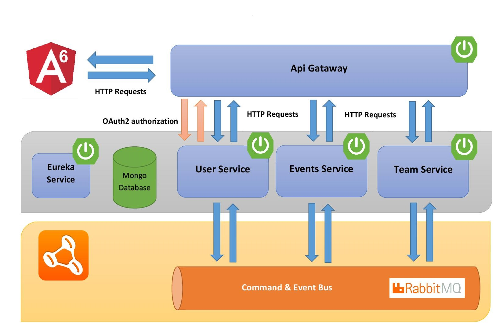

## OVERVIEW

Overview of general architecture. 

### SquadAgendaFrontend

Run `ng serve` for a dev server. Navigate to `http://localhost:4200/`. 

### SquadAgendaBackend

#### User Service

#### Team Service

#### Event Service

#### Eureka Service

#### Gateway Service
